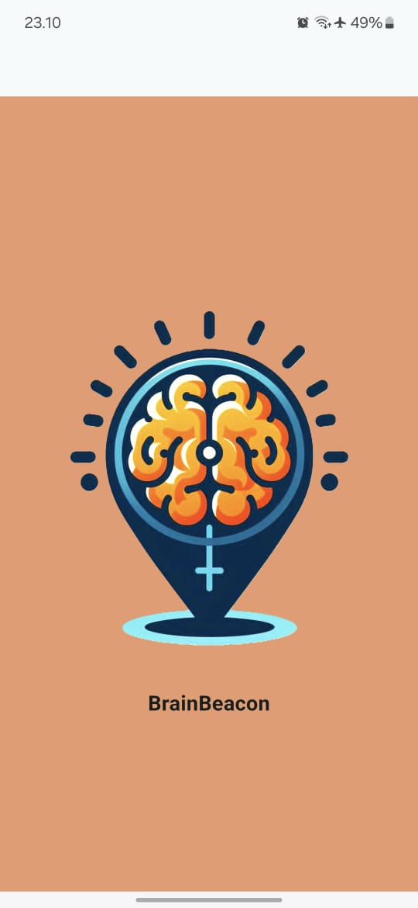
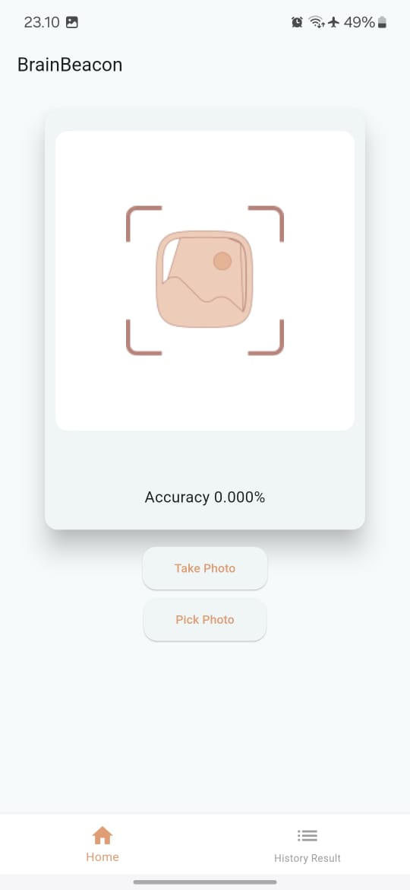
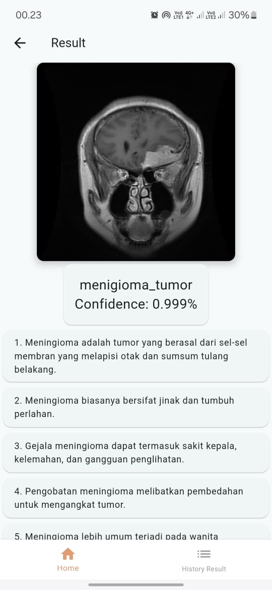
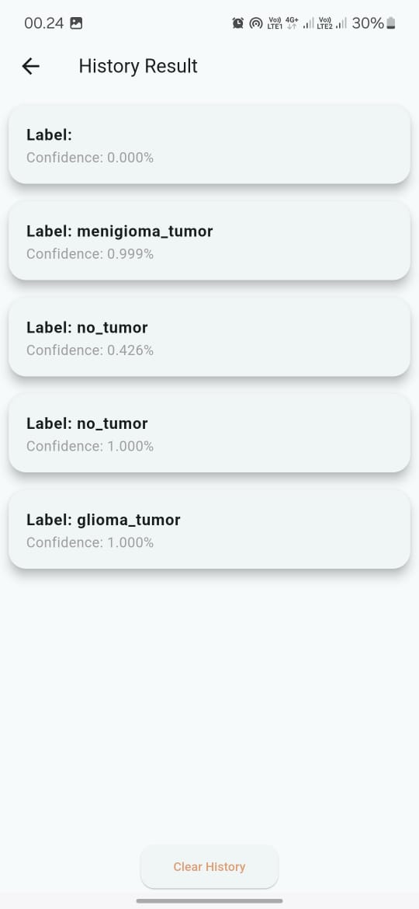

# Brain Beacon 

***Kelompok 7:**

Risa Rosarina            (2106009)\
Sahrudin Fiqri Muzahidat (2106024)

***Tentang Aplikasi**

Brain Beacon merupakan sebuah aplikasi mobile yang dapat digunakan untuk mendeteksi jenis tumor otak.\
Cara penggunaannya adalah dengan mengunggah foto berupa MRI dengan dua pilihan yaitu "Take Picture"\
(langsung memotret) ataupun "Pick Photo" (mengambil dari galeri). Selain itu, terdapat fitur history\
untuk melihat foto yang telah diunggah sebelumnya.

***Tampilan Aplikasi**

Berikut ini merupakan tampilan dari aplikasi *Brain Beacon.*

   

***Database**

Untuk penggunaan database, kami memakai API dari https://reqres.in/
